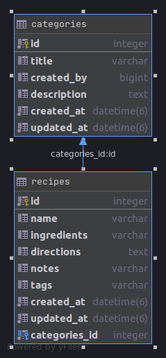

# Recipes API Part 2

## Part1 - create a model

Let's go ahead and create a model name it as `Recipe`. This model should be consist of the following `fields`.

|Field  | Data type | Usage
|--|--|--|
|  name | string | to store the recipe name |
|  ingredients | string | to store the list of ingredients |
|  directions | text | to store the recipe directions |
|  notes | string | to store extra information about the recipe | 
|  tags | string | list of tags that are associated with the recipe |

Great! So far we haven't created the Recipe table yet, and this is the ideal time to think about the relationship between `Recipe` and `Category` tables. In a real-world application, there could be many recipes that belong to a given category. We can create this `reference` inside our `Recipe` table.

Once you're completed adding all the fields and the reference don't forget to migrate the table.

If you finished the task correctly, the final ER diagram should look like this.



## Part2 - add model associations  
File path ```app/models/category.rb```

Change from
```ruby
class Category < ApplicationRecord
end
```

to

```ruby
class Category < ApplicationRecord
  # model association
  has_many :recipes, dependent: :destroy

  # validations
  validates_presence_of :title, :created_by
end
```

File path ```app/models/recipe.rb```

Change from

```ruby
class Recipe < ApplicationRecord
end
```

to

```ruby
class Recipe < ApplicationRecord
  # model association
  belongs_to :category

  # validation
  validates_presence_of :name
end
```

## Part3 - create a controller  
Create a `controller` name `Recipe` using the following command: `rails generate controller recipes`.

The RESTful API must consist of the endpoints (CRUD).

|Prefix| Verb|URI Pattern| Controller#Action |
|--|--|--|--|
|recipes|GET| /recipes(.:format)| recipes#index|
||POST|/recipes(.:format)|recipes#create|
|recipe|GET|/recipes/:id(.:format)|recipes#show|
||PATCH|/recipes/:id(.:format)|recipes#update|
||PUT|/recipes/:id(.:format)|recipes#update|
||DELETE|/recipes/:id(.:format)|recipes#destroy|

## Part4 - Test your RESTful API using POSTMAN
