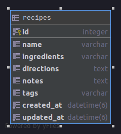

# Recipes API Part 1

## Part1 - create the RESTful API app
Using the following command `rails new recipe-api --api -skip-active-storage` create a new rest API project.

## Part2 - create a model

Let's go ahead and create a model name it as `Recipe`. This model should be consist of the following `fields`.

|Field  | Data type | Usage
|--|--|--|
|  name | string | to store the recipe name |
|  ingredients | string | to store the list of ingredients |
|  directions | text | to store the recipe directions |
|  notes | string | to store extra information about the recipe | 
|  tags | string | list of tags that are associated with the recipe |

Note: Don't forget to create the migration file and migrate the data.

## Part3 - create a controller  
Create a `controller` name `recipes` using the following command: `rails generate controller recipes`.

The RESTful API must consist of the endpoints (CRUD).

|Prefix| Verb|URI Pattern| Controller#Action |
|--|--|--|--|
|recipes|GET| /recipes(.:format)| recipes#index|
||POST|/recipes(.:format)|recipes#create|
|recipe|GET|/recipes/:id(.:format)|recipes#show|
||PATCH|/recipes/:id(.:format)|recipes#update|
||PUT|/recipes/:id(.:format)|recipes#update|
||DELETE|/recipes/:id(.:format)|recipes#destroy|

## Part4 - Test your RESTful API using POSTMAN
